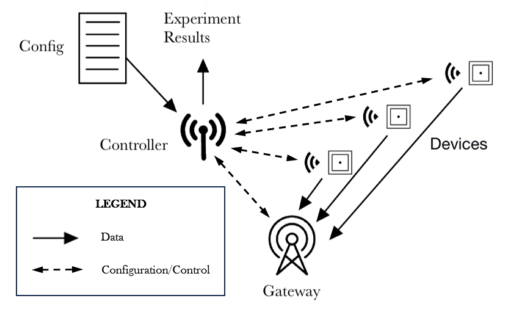

# LoRa Testbed

An infrastructure-less, arduino-compatible LoRa testbed for PHY and MAC research. The user will simply provide a config file (that contains the experiment configuration details) to the testbed. The controller will communicate with the network to then return the results after the experiment has ended. See below for a high level overview. 


*Diagram 1: High level overview of the LoRa Testbed.*


## Run a simple experiment with 1 device (9/14/23)

```bash
poetry run python3 ./loratestbed/main_controller.py -p /dev/ttyACM0 
```

This code will run a 20 second experiment with only device no. 33 and retrieve the total number of transmitted packets.

## Setup and installation

### Setting up the testbed

[Click here](./sketch/README.md) to go to the documentation on flashing various components in the testbed and bringing them up.

### Host software

Install poetry

```bash
pip install -U poetry
```

Navigate to the root directory of this git repository. Run tests:

```bash
poetry run pytest
```

Install:

```bash
poetry install
```
